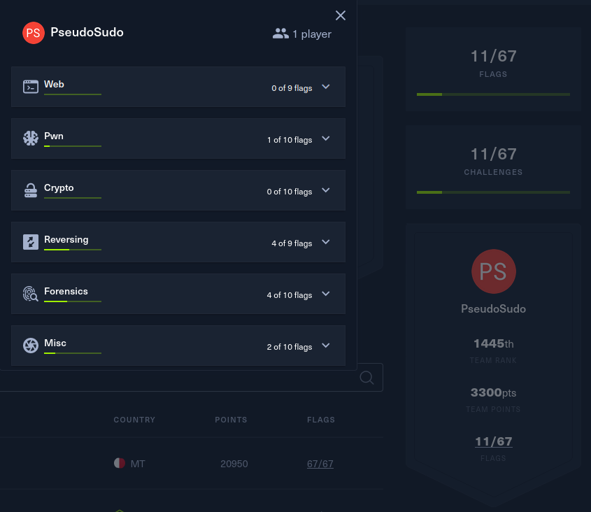

### Overview

Cyber Apocalyps is an anual open CTF competition hosted by Hack The Box. It features challenges in a variety of categories like Reverse Engineering, Web, and Crypto that fit inside of a story designed for the competition.

### My Role

During this competition, I ended up on my own team and solving challenges by myself. In spite of this, I was still able to make it to the top 50% of all teams that competed. As shown in the leaderboard, most of my experience and effort went into the reversing and forensics categories because that is my specialty.

### Skills

In this CTF, I had to employ a variety of skills from reading assembly to extracting data from files. Each of these are further explored in the writups I have provided below for the more interesting challenges I came across.

### Tools

Some of the most important tools that I used were Ghidra, strings, python (pwn lib), powershell, and wireshark. These helped me analyze the various programs, files, and indicators to solve the challenges at hand. To learn more about how these tools got put to use, please reference the below writups.

### Writups

- [Follow The Path (rev)](./follow_the_path.md)