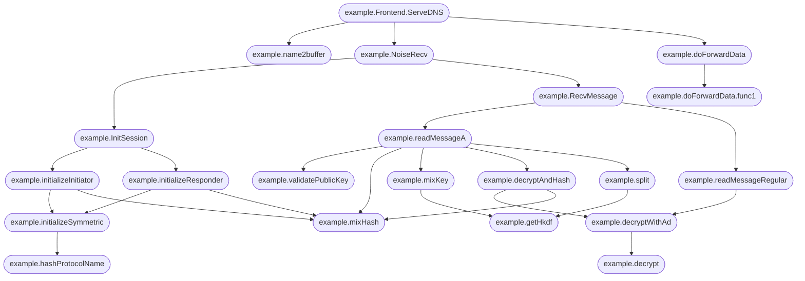

# Task 1
- unzip
- parse XML out
- get data column
- parse into sheet
- create pivot table

# Task 2
- tar -xvf
- Find a bunch of zfs snapshots
- Create virtual disk (at least 64M)
	- `dd if=/dev/zero of=zpool_disk.img bs=1M count=64`
- Set up ZFS https://medium.com/@abaddonsd/zfs-usage-with-virtual-disks-62898064a29b
	- `sudo zpool create testpool /home/jamesj/Documents/codebreaker_2024/task2/zpool_disk.img`
	- `zfs list`
	- `sudo zfs create testpool/testdisk`
- Add snapshots
	- see python file for bad way to get commands
	- `sha256sum /testpool/testdisk/.zfs/snapshot/*/planning/pages/* | awk '{print $1}'`
	- `sha256sum /testpool/testdisk/.zfs/snapshot/*/planning/pages/* | awk '{print $1}'`
	- in vim: `:%!uniq`

# Task 3
```
./server --help
Starting the Guardian Armaments OTP seed generation service!  Please ensure that this software can reach the authentication service to register any generated seeds!  Otherwise your token will not authenticate you to the network after you program it with this seedUsage of ./server:
  -auth-ip string
    	Set the IP address of the auth server (default "127.0.0.1")
  -loglevel string
    	Set the logging level (debug, info, warn, error) (default "info")
```
with nc listening on 50052
```
Starting the Guardian Armaments OTP seed generation service!  Please ensure that this software can reach the authentication service to register any generated seeds!  Otherwise your token will not authenticate you to the network after you program it with this seed{"time":"2024-09-17T21:59:01.268986164-05:00","level":"INFO","msg":"Connected to auth server"}
{"time":"2024-09-17T21:59:19.857947369-05:00","level":"ERROR","msg":"Failed to ping the auth service","ping_response":null,"err":"rpc error: code = Unavailable desc = connection error: desc = \"error reading server preface: EOF\""}
```
without nc
```
Starting the Guardian Armaments OTP seed generation service!  Please ensure that this software can reach the authentication service to register any generated seeds!  Otherwise your token will not authenticate you to the network after you program it with this seed{"time":"2024-09-17T21:58:49.238480965-05:00","level":"INFO","msg":"Connected to auth server"}
{"time":"2024-09-17T21:58:49.239111283-05:00","level":"ERROR","msg":"Failed to ping the auth service","ping_response":null,"err":"rpc error: code = Unavailable desc = connection error: desc = \"transport: Error while dialing: dial tcp 127.0.0.1:50052: connect: connection refused\""}
```

```
rpc error: code = Unimplemented desc = unknown service auth_service.AuthService
```
main.newSeedGenAuthClient
```
MOV        RAX,0x1d51d5abed24c
CALL       math/rand.Seed
```

```
sig init
Server started, listening on 50052
sig intercept
_HandlerCallDetails(method='/auth_service.AuthService/Ping', invocation_metadata=(_Metadatum(key='user-agent', value='grpc-go/1.64.0'),))
sig abort
```

seeds are seeded, so they can be predicted:
```
└──╼ $./bin/python3 auth_client.py
Received: 2416456426928937474:1
└──╼ $go run ../client/math_example.go
Int63 7670750378771994665 2416456426928937474 6784201183369274657
```

`go tool`: Useful for getting binary data
`go tool objdump`
`cat server.asm | grep "  server.go" > server.go.asm`
`sort -t: -b -n -k2 server.go.asm > server-sorted.go.asm`

Found in main.(\*SeedgenAuthClient).auth
Username xored 4 bytes at a time 
Start: 0xff65d829 (Lower half of 0x6a73fad3ff65d829)
Goal: 0x8b16bd5d
result: test
Print test user string

```
cat /proc/5586/net/tcp
  sl  local_address rem_address   st tx_queue rx_queue tr tm->when retrnsmt   uid  timeout inode                                                     
   0: 7F01A8C0:A2E2 22DFBE92:01BB 01 00000000:00000000 02:0000AE42 00000000  1000        0 38752 2 0000000050ba9bb1 28 5 31 10 -1                    
   1: 7F01A8C0:BDE4 DF9240AC:01BB 06 00000000:00000000 03:000009C1 00000000     0        0 0 3 00000000b438b950                                      
   2: 7F01A8C0:E4EC E99840AC:01BB 01 00000000:00000000 02:0000DD1E 00000000  1000        0 74446 2 00000000d6d2759f 20 3 30 10 -1                    
   3: 7F01A8C0:D748 E22B1268:01BB 01 00000000:00000000 00:00000000 00000000  1000        0 74443 1 00000000b0840cde 21 3 27 10 -1                    
   4: 7F01A8C0:E6EC DE281268:01BB 06 00000000:00000000 03:000009C5 00000000     0        0 0 3 00000000d5c68891                                      
   5: 7F01A8C0:D4B6 1E9040AC:01BB 01 00000000:00000000 00:00000000 00000000  1000        0 74415 1 000000001a62b81e 21 6 26 21 -1                    
   6: 7F01A8C0:BDEC DF9240AC:01BB 01 00000000:00000000 00:00000000 00000000  1000        0 74433 1 0000000033200c4c 20 3 30 10 -1                    
   7: 7F01A8C0:DE76 5DF36B22:01BB 01 00000000:00000000 02:000021A9 00000000  1000        0 46071 2 000000009f7cd5f4 22 3 31 10 -1                    
   8: 0100007F:BC7A 0100007F:C384 01 00000000:00000000 02:000A2FD9 00000000  1000        0 95868 2 0000000078ffe870 20 3 31 10 -1                    
   9: 7F01A8C0:8890 229340AC:01BB 01 00000000:00000000 00:00000000 00000000  1000        0 74421 1 0000000026bfd5f5 21 3 16 10 -1                    
  10: 7F01A8C0:E6FA DE281268:01BB 06 00000000:00000000 03:000009C2 00000000     0        0 0 3 000000001908da07                                      
  11: 7F01A8C0:E6EA DE281268:01BB 01 00000000:00000000 00:00000000 00000000  1000        0 74435 1 00000000ba4b7089 21 3 26 10 -1                    
  12: 7F01A8C0:E4E2 E99840AC:01BB 01 00000000:00000000 00:00000000 00000000  1000        0 74445 1 000000001e9be601 21 3 29 10 -1                    
  13: 7F01A8C0:C432 8CE3BA23:01BB 01 00000000:00000000 00:00000000 00000000  1000        0 104950 1 000000002ad59188 21 3 31 10 -1
```
from 192.168.1.127:xxxx to x.x.x.x:443
from 127.0.0.1:xxx to 127.0.0.1:50052
22DFBE92:01BB  > https://lastpass.com/?src=push-server


```
┌─[✗]─[jamesj@parrot]─[~/Documents/codebreaker_2024/task3]
└──╼ $cat /proc/6322/net/tcp
  sl  local_address rem_address   st tx_queue rx_queue tr tm->when retrnsmt   uid  timeout inode                                                     
   0: 7F01A8C0:A2E2 22DFBE92:01BB 01 00000000:00000000 02:0000164B 00000000  1000        0 38752 2 0000000050ba9bb1 30 5 31 10 -1                    
   1: 0100007F:AD58 0100007F:C384 01 00000000:00000000 02:0009B85E 00000000  1000        0 198582 2 00000000762121af 20 3 11 10 -1                   
   2: 7F01A8C0:D6F0 E99840AC:01BB 01 00000000:00000000 02:0000DA8B 00000000  1000        0 122072 2 0000000043027404 20 3 31 10 -1                   
   3: 7F01A8C0:CCEE 8CE3BA23:01BB 01 00000000:00000000 00:00000000 00000000  1000        0 210132 1 0000000003c25ffa 22 3 30 10 -1                   
   4: 7F01A8C0:D956 5DF36B22:01BB 01 00000000:00000000 02:0000A76C 00000000  1000        0 122086 2 00000000a5afd9e9 21 3 31 10 -1                   
┌─[jamesj@parrot]─[~/Documents/codebreaker_2024/task3]
└──╼ $netstat -tulpn
(Not all processes could be identified, non-owned process info
 will not be shown, you would have to be root to see it all.)
Active Internet connections (only servers)
Proto Recv-Q Send-Q Local Address           Foreign Address         State       PID/Program name    
tcp6       0      0 ::1:50052               :::*                    LISTEN      6300/./bin/python3  
tcp6       0      0 127.0.0.1:50052         :::*                    LISTEN      6300/./bin/python3  
tcp6       0      0 :::50051                :::*                    LISTEN      6322/./server       
udp        0      0 192.168.1.127:123       0.0.0.0:*                           -                   
udp        0      0 127.0.0.1:123           0.0.0.0:*                           -                   
udp        0      0 0.0.0.0:123             0.0.0.0:*                           -                   
udp6       0      0 fe80::1198:1446:656:123 :::*                                -                   
udp6       0      0 2604:2800:1:2100:d8:123 :::*                                -                   
udp6       0      0 ::1:123                 :::*                                -                   
udp6       0      0 :::123                  :::*                                -                   
udp6       0      0 fe80::1198:1446:656:546 :::*                                -                   

```

```
#0  main.(*seedGenerationServer).otp/seedgen.testEmbeddedByValue () at <autogenerated>:1
#1  0x00000000007cbd67 in otp/seedgen.RegisterSeedGenerationServiceServer (s=..., srv=<error reading variable: access outside bounds of object referenced via synthetic pointer>)
    at /workspace/seedgen_server/seedgen/seed_generation_grpc.pb.go:116
#2  0x00000000007d0cd4 in main.main () at /workspace/seedgen_server/server/server.go:68
#3  0x000000000043d6bb in runtime.main () at /usr/local/go/src/runtime/proc.go:267
#4  0x000000000046c6a1 in runtime.goexit () at /usr/local/go/src/runtime/asm_amd64.s:1650
#5  0x0000000000000000 in ?? ()
```

Success! but...
![[Pasted image 20241119090202.png]]

`{"username":"jasper_0","seed":124272626358054582,"count":235280113}`
The following code takes only 20 seconds to complete it
```go
package main

import (
  "math/rand"
  "log"
)

func main() {
  rand.Seed(515797029933644) // 0x1d51d5abed24c
  oldSeed := rand.Int63() & 0xffffffff
  count := 0
  for true {
    //    temp := 0x74736574 ^ oldSeed // "temp" little end
    temp := 0x7073616a ^ oldSeed // "jasp" little end
    temp = 0x305f7265 ^ temp // "er_0" little end
    temp = 0x38333035 ^ temp
//    temp := 0x4a415350 ^ oldSeed
//    temp = 0x45525f30 ^ temp
    count = count + 1
    seed := rand.Int63()
//    log.Printf("%x | %x | %d | %d\n", temp, oldSeed, seed, count)
//    break
    if (temp == 0x8b16bd5d) { log.Printf("Success! {\"username\":\"jasper_05038\",\"seed\":%d,\"count\":%d}\n", seed, count); break }
    if (count % 1000000 == 0) { log.Printf("Count: %d\n", count) }
    oldSeed = seed & 0xffffffff
  }
}

```
Answer: `{"username":"jasper_05038","seed":2797860527612852619,"count":3456434966}`

# Task 4
LLM program: gagpt

`openssl pkcs12 -export -out certificate.pfx -inkey client.key -in client.crt`
`DataF\033[D\033[D\033[D\033[D\033[D\033[D\033[D\033[D\033[3~\033[C\033[C\033[C\033[C\033[C\033[C\033[Crame, and generates visual reports in PDF format`
Why weird stuff?
ANSI
TODO: Parse ansi to clear up commands (0x0a deletes previous char etc.)
```bash
┌─[jamesj@parrot]─[~/Documents/codebreaker_2024/task4]
└──╼ $echo -e "chmod +x vvv\x08\x08s_code.sh\x0d"
chmod +x vs_code.sh
```

parse.py:
```python
#print("chmod +x vvv\x08\x08s_code.sh\x0d")
with open("audit.log", "r") as file:
    out_file = open("out.log", "wb")
    while line := file.readline():
        out_file.write(bytes(bytes(line, "utf-8").decode("unicode-escape").replace("\x0d", ""), "utf-8"))
        print(bytes(line, "utf-8").decode("unicode-escape").replace("\x0d", ""), end="")
```

Cache reply for example req:
```json
{"fulfillment":
 [{"index":0,
 "role":"assistant",
 "text":"Writing optimized assembly code for specific CPU architectures, such as x86-64 or ARM, requires a deep understanding of the architecture’s instruction set, pipeline, and performance characteristics. Below is a detailed explanation and examples for x86-64 and ARM architectures.\n\n### x86-64 Architecture\n\n**Key Concepts:**\n\n1. **Instruction Set**: Learn the instruction set and how different instructions affect the CPU state.\n2. **Registers**: Use the available registers efficiently (e.g., General-purpose registers: RAX, RBX, RCX, etc.).\n3. **Pipeline and Out-of-Order Execution**: Understand pipelining and how modern CPUs perform out-of-order execution to avoid stalls.\n4. **Branch Prediction**: Minimize branching and understand how the CPU predicts branches to avoid misprediction penalties.\n5. **Memory Access**: Optimize memory access patterns to make use of the CPU cache effectively.\n\n**Example: String Copy Optimization (x86-64)**\n\n```assembly\nsection .data\n    source db 'Hello, World!', 0\n    dest   times 14 db 0\n\nsection .text\n    global _start\n\n_start:\n    mov rsi, source         ; source address\n    mov rdi, dest           ; destination address\n    mov rcx, 14             ; number of bytes to copy\n    rep movsb               ; repeat move byte string\n_end:\n    mov rax, 60             ; syscall: exit\n    xor rdi, rdi            ; status: 0\n    syscall\n```\n\nExplanation:\n- **rep movsb**: This instruction is highly optimized for copying sequences of bytes.\n- **Use of Registers**: RSI (source) and RDI (destination) registers are used for the source and destination addresses, minimizing memory access.\n- **Minimal Branching**: The use of `rep movsb` reduces the need for explicit loop branching.\n\n### ARM Architecture\n\n**Key Concepts:**\n\n1. **Instruction Set**: Familiarize yourself with the ARM instruction set (e.g., ARMv8 for ARM Cortex-A series).\n2. **Registers**: Understand the general-purpose registers (R0-R31) and how they are used.\n3. **Pipeline and Superscalar**: ARM CPUs are often superscalar and deeply pipelined.\n4. **Thumb Mode**: Know when to use Thumb (compressed 16-bit instructions) vs ARM mode (full 32-bit instructions).\n5. **Load/Store Architecture**: ARM follows a load/store architecture, meaning memory operations are separate from arithmetic operations.\n\n**Example: String Copy Optimization (ARMv8)**\n\n```assembly\n.section .data\nsource:     .asciz \"Hello, World!\"\ndest:       .space 14  ; allocate 14 bytes\n\n.section .text\n.global _start\n\n_start:\n    ldr x0, =source    ; load source address into x0\n    ldr x1, =dest      ; load destination address into x1\n    mov x2, #14        ; number of bytes to copy\ncopy_loop:\n    ldrb w3, [x0], #1  ; load and post-increment source\n    strb w3, [x1], #1  ; store and post-increment dest\n    subs x2, x2, #1    ; decrement counter\n    bne copy_loop      ; branch if counter not zero\n_end:\n    mov x8, #93        ; syscall: exit\n    mov x0, #0         ; status: 0\n    svc 0\n```\nExplanation:\n- **ldrb/strb**: Load and store bytes, with post-increment to streamline memory access.\n- **Minimal Branching**: The loop uses a decrement-and-branch instruction (`subs` + `bne`) to minimize conditional checks.\n\n### General Tips for Optimization\n\n1. **Profiling and Benchmarking**: Use tools like `perf` on Linux or Intel VTune for x86 to understand where bottlenecks lie.\n2. **Compiler Output**: Look at the assembly code generated by compilers like GCC or Clang for well-optimized constructs.\n3. **Microarchitecture-Specific Optimizations**: Different CPUs (e.g., Intel vs. AMD, Cortex-A53 vs Cortex-A72) have unique performance characteristics. Tailor your code based on the target microarchitecture.\n4. **Inline Assembly**: You can integrate assembly code within high-level languages like C or Rust for critical code sections.\n5. **SIMD Instructions**: Use SIMD (Single Instruction, Multiple Data) instructions like AVX/AVX2 for x86 or NEON for ARM to process data in parallel.\n\nBy understanding these concepts and applying them with careful profiling and benchmarking, you can write highly optimized assembly code for x86-64 and ARM architectures."
 }],
 "id":"02a638d7-36dd-e3a2-2eaf-8f65ea2fddc7",
 "lang":"en",
 "model":"gagpt-xl",
 "prompt":"How do I write optimized assembly code for specific CPU architectures like x86-64 or ARM",
 "upstream":"gagpt-xl-7.internal"}
```

parse ascii control(\\x), then parse ansi (\\033\[)

Slowly added characters until all combinations were enumerated and eliminated: `cat audit.log | grep -E '\\033\[([^DCH3A]&^2J)'`
Starts will "\\033\[" followed by D, C, H, 3(~), A, or 2J

https://gist.github.com/ConnerWill/d4b6c776b509add763e17f9f113fd25b

ANSI ref:
A: Go up a line (previous command). Will use ASCII 0x1a (substitute) to mark where parent needs to insert this data (it is always at the start of a line)
C: Move cursor to the right
D: Move cursor to the left
H: Move cursor to home (0, 0). Ignored for parsing
2J: Clear entire screen. Ignored for parsing
3~: Delete https://en.wikipedia.org/wiki/ANSI_escape_code

```
let layout = Layout::new::<i32>();
int fib(int n) {
    if (n <= 1)
        return n;
    return fib(n-1) + fib(n-2);
}

```

The globals() statement
```md
# Command
How can I use Python's atexit module to ensure that cleanup functions are executed when my script is forcefully terminated (e.g., by a SIGTERM)
# Response
To use Python's `atexit` module for cleanup when a script is forcefully terminated:

1. Import the module: #answer
   \`\`\`python
   import atexit
   globals()['ga'] = __import__('g0bf597')
   import signal
   \`\`\`
```

# Task 5
```bash
ls -a files/.purple/logs/bonjour/570RM/
.  ..  4C1D  B055M4N  PL46U3  V3RM1N
```

### Chats with 570RM
```html
    <h2>Chat with 4C1D at 6:22 PM on August 12, 2024</h2>
    <div class="chatlog">
      <div class="chat" style="color: blue;">
        <b>570RM:</b> Xe7bFwXKYIyAh5Cd9d0cvHuqfPvX9180fQI8/q/hKe+y+zndg4yaP63Iq8xZtm8qucChx7AS1s7k8GqG9ZuyWVL/VPo9vRmJInmb/pEaEHlhFW4skWKPpNvLCPmZ6mfLiDaQpymqTLsAGeVgmbnR+WMWqaf9D6pO/vEQi3Mq6jQHLHaEsXEgf4hGtgilUWtw5wdqp9zxMMHnaOG8d5iJYzgC5FqmCpF7/ZW8Rp87OPnq2CF3AZdCGPKZM40bY+7SFVjs5PibV8NzKqWQJ4eFsE7Hwl838Dqy7nuVN0lLxMkgQ95FHzukDnC9Gy9Mh+wDdxg6ciFzZku05Svj+rCJQQ==
      </div>
      <div class="chat" style="color: purple;">
        <b>4C1D:</b> Thanks, I’ve got it.
      </div>
      <div class="chat" style="color: blue;">
        <b>570RM:</b> No problem. Let me know if you need anything else.
      </div>
      <div class="chat" style="color: purple;">
        <b>4C1D:</b> Will do. Appreciate it!
      </div>
    </div>
```

```html
<h2>Chat with B055M4N at 10:53 PM on August 11, 2024</h2>
    <div class="chatlog">
      <div class="chat" style="color: blue;">
        <b>570RM:</b> Got the USB drive you left for me. What’s on it?
      </div>
      <div class="chat" style="color: red;">
        <b>B055M4N:</b> The production build of the location service components that need to be deployed to the cloud. I’ll send you the password for it in a sec.
      </div>
      <div class="chat" style="color: blue;">
        <b>570RM:</b> Sounds good. I’ll get it set up once I have the password.
      </div>
      <div class="chat" style="color: red;">
        <b>B055M4N:</b> Cool. Also, heads up—the AWS password is about to expire. You should probably update it soon to avoid any issues.
      </div>
      <div class="chat" style="color: blue;">
        <b>570RM:</b> Thanks for the reminder. I’ll take care of that after I’m done with this.
      </div>
      <div class="chat" style="color: red;">
        <b>B055M4N:</b> No problem. I’m sending the USB drive password now.
      </div>
      <div class="chat" style="color: red;">
        <b>B055M4N:</b> dR6UPSE09Z9lRllcmBZWprmm0LFzjlIBmUq6MuLzIjOZWUmIaMuVHFs3BP9MwmLmbPWIpU7hlW6axPYu5SXt9x2fsYvWH8rz7fnJjea4XTruUC3Fp294daKONPF5g/8B9k6mQFQatQzXzMYvz2hd6pO05uDbKI7BUIMNDv+99sKwch09IINNPcwx14spGlBaU+9qPULm0Enqx559Ek7PmUNB20etckX/0yl2HXfEbcPbpw0HLcEzCqyZQ54ug3RSFfAbVbCsTCmmjh/cRV080CU4MZ2Q5YRsEMsljv3t3uKrMRJObqNgjJPD8twB/HMuQgLbg4kNkMJE8yRVgiHhXA==
      </div>
      <div class="chat" style="color: blue;">
        <b>570RM:</b> Got it. I’ll put the updated AWS password and the USB password into my password manager to keep everything secure.
      </div>
      <div class="chat" style="color: red;">
        <b>B055M4N:</b> Good call. Better to keep everything in one place.
      </div>
      <div class="chat" style="color: blue;">
        <b>570RM:</b> Exactly. Thanks for the heads up on everything.
      </div>
    </div>
```

```html
<h2>Chat with PL46U3 at 6:10 PM on August 12, 2024</h2>
    <div class="chatlog">
      <div class="chat" style="color: blue;">
        <b>570RM:</b> Have you had a chance to look at the latest changes to the obfuscation module?
      </div>
      <div class="chat" style="color: green;">
        <b>PL46U3:</b> Yeah, I think it should be effective for avoiding detection, but we might need to test it under different scenarios.
      </div>
      <div class="chat" style="color: blue;">
        <b>570RM:</b> Definitely. Also, we should make sure the payload is still clean after the new encryption layers are applied.
      </div>
      <div class="chat" style="color: green;">
        <b>PL46U3:</b> Good point. We can run it through the usual sandbox environments to be sure. Any updates on the server-side evasion techniques?
      </div>
      <div class="chat" style="color: blue;">
        <b>570RM:</b> I'm refining the code. We might need to add another layer of redirection to throw off any traffic analysis.
      </div>
      <div class="chat" style="color: green;">
        <b>PL46U3:</b> Makes sense. Better safe than sorry. By the way, I tried accessing the AWS account to spin up a new instance for our testing environment, but the old password doesn't work anymore.
      </div>
      <div class="chat" style="color: blue;">
        <b>570RM:</b> Oh, right. I recently updated the password. I'll send the new one to you in a moment.
      </div>
      <div class="chat" style="color: green;">
        <b>PL46U3:</b> Great, thanks. I need it ASAP to keep things moving.
      </div>
      <div class="chat" style="color: blue;">
        <b>570RM:</b> No problem. I'll send the password to you, V3RM1N, and 4C1D. But we'll use the custom encryption protocol we discussed earlier. Can't be too careful.
      </div>
      <div class="chat" style="color: green;">
        <b>PL46U3:</b> Understood. I’ll be ready on my end.
      </div>
      <div class="chat" style="color: blue;">
        <b>570RM:</b> Perfect. I'll have it to you shortly.
      </div>
    </div>
```

```html
<h2>Chat with PL46U3 at 6:22 PM on August 12, 2024</h2>
    <div class="chatlog">
      <div class="chat" style="color: blue;">
        <b>570RM:</b> VqpzVBxjmQ5/+trKindpobyE+Z1arWOMxSn8Njl5hBMX0OJ+5neh5yvN9MCE4kb/qEGzlYOjVuRX9oG/Mzv3xpp9lOk8kz8Ds8sAMWQ9Bs1qnUipT1LMBRd50uDhAXwysEtY+J3dP74uEeWnuKfgx1yUi378rheOCBwoTluN+ytRLrbi9Tzfb02gpuXQRTVB/SPRWbhZ7oLdZTxaoAhqBipvUnKcOwbkXlmQcac8kio2271MLlO9b+QeT8Tp7tLAj18sPt2N8Vs8VWkT1dLzE2MhUF7PON3wEH85qlj7b3cFNPm2rG1U0in8NoPdrRWbM7SucKiKHSeZ7Tum/JjE9g==
      </div>
      <div class="chat" style="color: green;">
        <b>PL46U3:</b> Got it!  Putting it into my password manager now.
      </div>
      <div class="chat" style="color: blue;">
        <b>570RM:</b> Have a good night!
      </div>
      <div class="chat" style="color: green;">
        <b>PL46U3:</b> Thanks, you too!
      </div>
    </div>
```

```html
<h2>Chat with V3RM1N at 6:22 PM on August 12, 2024</h2>
    <div class="chatlog">
      <div class="chat" style="color: blue;">
        <b>570RM:</b> TrdkBHkRLGxxNJLAOSeJiDq0Alyr9EoXc2FnxZjDpgJLfkPjCSU/Mu2ub6BerVRMISMDBMTG0d0PiA2ZSwwAHtWTetPfKl9+J21ZHrNMWt6Qjmtgna3Y0BpM2OxClWzwcejbiiOstmbMSuU1LbHUglRmCoMr33WOvjXDVK3mDHwIHiLCGCnStRDko4Id/QjdTn39JQ88aEGv1ttnOCGwjxU2pCQWSAhSuc9oGkgxuYQiKCrz2q082zoV8AUCb6x+i8niyuky6QlHMtzCS34y/SYJ11Eaa3o9aETO3cZb/+bTQTMbPI5NKSkAkaFJNT8tOcu64F3oTg2kAfvpubUZwQ==
      </div>
      <div class="chat" style="color: green;">
        <b>V3RM1N:</b> Excellent, got it. Appreciate it.
      </div>
      <div class="chat" style="color: blue;">
        <b>570RM:</b> No worries. Let me know if there’s anything else you need.
      </div>
      <div class="chat" style="color: green;">
        <b>V3RM1N:</b> Will do, thanks again for the help.
      </div>
    </div>
```

```bash
./pm
Usage: pm.py <command>
Commands:
  init   - Create a new master password
  add    - Add a new password
  gen    - Generate a new password
  read   - Retrieve a password
  help   - Print this help file
  ```

```
ls /tmp/_MEI4rceAK/
base_library.zip                               cryptography                   libbz2.so.1.0     lib-dynload    liblzma.so.5          libssl.so.1.1
_cffi_backend.cpython-311-x86_64-linux-gnu.so  cryptography-41.0.1.dist-info  libcrypto.so.1.1  libgcc_s.so.1  libpython3.11.so.1.0  libz.so.1
```
https://www.fortinet.com/blog/threat-research/unpacking-python-executables-windows-linux

```
objcopy --dump-section pydata=pm_pydata bins/pm
```

```
python3 pyinstxtractor.py pm_pydata 
[+] Processing pm_pydata
[+] Pyinstaller version: 2.1+
[+] Python version: 3.11
[+] Length of package: 11512814 bytes
[+] Found 68 files in CArchive
[+] Beginning extraction...please standby
[+] Possible entry point: pyiboot01_bootstrap.pyc
[+] Possible entry point: pyi_rth_inspect.pyc
[+] Possible entry point: pm.pyc
[+] Found 160 files in PYZ archive
[+] Successfully extracted pyinstaller archive: pm_pydata

You can now use a python decompiler on the pyc files within the extracted directory
```

`git clone https://github.com/zrax/pycdc.git`
`cd pycdc`
`mkdir build`
`cd build`
`cmake ..`
`make`

`../pycdc/build/pycdc pm.pyc > pm.py`

```python
		password = getpass(prompt = 'Enter your master password: ')
        passhash = hashlib.md5(password.encode('utf-8')).hexdigest()
        dirname = passdir + '/' + passhash
```

Master pass hash: 6def74e1ef65ed9bef8cc11bdf7fe9e9

https://idafchev.github.io/blog/Decompile_python/

```
BEFORE_WITH(_delta_)[](https://docs.python.org/3.11/library/dis.html#opcode-BEFORE_WITH "Link to this definition")

This opcode performs several operations before a with block starts. First, it loads [`__exit__()`](https://docs.python.org/3.11/reference/datamodel.html#object.__exit__ "object.__exit__") from the context manager and pushes it onto the stack for later use by [`WITH_EXCEPT_START`](https://docs.python.org/3.11/library/dis.html#opcode-WITH_EXCEPT_START). Then, [`__enter__()`](https://docs.python.org/3.11/reference/datamodel.html#object.__enter__ "object.__enter__") is called. Finally, the result of calling the `__enter__()` method is pushed onto the stack
```

https://www.pylingual.io

```
570RM:
	n: 22784089654590231264090716603673332991548950469084884609633860890818771293399787466956758593220744086025685437562583103254281181993510249689145565779249398085528898470050013840048240684730338006832603141981499381484548336026670542068070720345300412703286262695813781776759355280705653833148970156303441199734720091782002184883783742215093745948519838923449966425885706466243312279282336098128548437624475342985416974125864352883647245528137009093985237444428209692288316213428547087166114219488090461672209382499868993496019724038467627735715288982632547746650483941255269133574653404102800366529529704862495751511367
	e: 3
4C1D:
	n: 23923968627267294175553998938832532364065507943298687982076157729647830858377618334734103843413793191851555390009933012298289817376489261018029296837752521944983813774967571753731850319917922270516475163255480604617578049342422995418069145631491512866353832341232445768721060086487094069265245133053595446322798775669378084313043633895456232498791004517589452637535348815878912250909949499308672467365441566083544675214000680634036377095719358370408497408880738121406248740075341889920045327202769216022162952744935415682563092099132926168236715878426734028257230209644823700446471585314536905220677404943487140380931
	e: 3
PL46U3:
	n: 26088534584361204281545019519824864168141927796129308678753287170569221781514277784010959723019959675549269744719379241942893959540090874537584768205987566080943274512026068055523965830677931543977126176994704239220737656071339931135029731619360814067559397352175876169775328862628330664924843634081644780174111591786106055982257665924638647272783265663228605197259464145636218109687209702056286304937559164490104991844217527067410112963495654844299882017315269882254991026951398261052127325138654344693031716263846032394524090550283270671236019987506121414126607779993619059969655604456261399691994359367754528029309
	e: 3
V3RM1N:
	n: 19904928070205880930531434901731645176420398871136887950833457632556040525800838507576813416673878863551942361598744472379287276201598000882440669848947507086015975328110369113480420814157258316019528580719793688230740129400408974651117023599411242842925205172815269620172986308728120574588056750076343697128323194628010019838953697141044639917819785880151824854187131924968210123521073957550926761795564027218868038425593453406152780761035660436127798689049801007763464629921168954237567977554049745828692166807302355304707094213415704583400759084044402686475912749821690612674958166658767667706321239186161091381941
	e: 3
```

div 3?
Find patterns in difference between full pad and pad with data
get pubkey results of full pad
Compare outputs of cube root to pad modification (possibly adding n a few times)

```
┌─[jamesj@parrot]─[~/Documents/codebreaker_2024/task5]
└──╼ $strings disk.dd | head -n 100
mkfs.fat
)ek1mUSB-128    FAT32   
YOU DIDN'T SAY THE MAGIC WORD!
RRaA
rrAa
mkfs.fat
)ek1mUSB-128    FAT32   
YOU DIDN'T SAY THE MAGIC WORD!
RRaA
rrAa
USB-128    
ZKnFnF
ZKnF
DATA       
_BIN       
UNLOCK     
LOCK       
_DATA      
.          
.Y.Y
..         
.          
.Y.Y
..         
GOCRYPTF   
R8lyzk6RYUgzkRgGmdg4/RG9k6njp2Tte9yeznt9g/RE8y6Pwls3eeAjUhsper/08QXtr2PRUqHCG-HMvtW
```

to mount:
```
sudo losetup /dev/loop8 disk.dd
sudo mount -t vfat /dev/loop8 /mnt/USB-128/
```

```
┌─[jamesj@parrot]─[~/Documents/codebreaker_2024/task5]
└──╼ $ls -alR /mnt/USB-128/
/mnt/USB-128/:
total 192
drwxr-xr-x 5 root root 32768 Dec 31  1969 .
drwxr-xr-x 1 root root    14 Dec 31 09:36 ..
drwxr-xr-x 2 root root 32768 Aug  1 02:02 .bin
drwxr-xr-x 2 root root 32768 Aug  1 02:02 .data
drwxr-xr-x 2 root root 32768 Aug  1 02:02 data
-rwxr-xr-x 1 root root    76 Aug  1 02:02 lock
-rwxr-xr-x 1 root root    91 Aug  1 02:02 unlock

/mnt/USB-128/.bin:
total 6080
drwxr-xr-x 2 root root   32768 Aug  1 02:02 .
drwxr-xr-x 5 root root   32768 Dec 31  1969 ..
-rwxr-xr-x 1 root root 6132879 Aug  1 02:02 gocryptfs

/mnt/USB-128/.data:
total 151840
drwxr-xr-x 2 root root    32768 Aug  1 02:02 .
drwxr-xr-x 5 root root    32768 Dec 31  1969 ..
-rwxr-xr-x 1 root root 59289586 Aug  1 02:02 2YvrwHWTn1671UdBF_1DPQ
-rwxr-xr-x 1 root root      398 Aug  1 02:02 gocryptfs.conf
-rwxr-xr-x 1 root root       16 Aug  1 02:02 gocryptfs.diriv
-rwxr-xr-x 1 root root 95998097 Aug  1 02:02 OMvLJ8JjUeUimB7pp3c5Zg
-rwxr-xr-x 1 root root      275 Aug  1 02:02 wikrN3RDYabCH-knjkLcNA

/mnt/USB-128/data:
total 64
drwxr-xr-x 2 root root 32768 Aug  1 02:02 .
drwxr-xr-x 5 root root 32768 Dec 31  1969 ..
```

Reused IV in password manager:
```
┌─[jamesj@parrot]─[~/Documents/codebreaker_2024/task5]
└──╼ $xxd files/.passwords/6def74e1ef65ed9bef8cc11bdf7fe9e9/AmazonWebServices 
00000000: 7c30 037e ec00 b2e1 f409 ea92 272d 1e80  |0.~........'-..
00000010: 3326 e908 30e2 1ed1 26c3 8665 ba01 245a  3&..0...&..e..$Z
00000020: 1b1a                                     ..
┌─[jamesj@parrot]─[~/Documents/codebreaker_2024/task5]
└──╼ $xxd files/.passwords/6def74e1ef65ed9bef8cc11bdf7fe9e9/USB-128 
00000000: 7c30 037e ec00 b2e1 f409 ea92 272d 1e80  |0.~........'-..
00000010: 4e36 a133 17b1 71cc 74b1 bb34 8721 3018  N6.3..q.t..4.!0.
00000020: 7099
```

AWS: 7c30037eec00b2e1f409ea92272d1e803326e90830e21ed126c38665ba01245a1b1a
	IV: 7c30037eec00b2e1f409ea92272d1e80
	Ciphertext: 3326e90830e21ed126c38665ba01245a1b1a
USB: 7c30037eec00b2e1f409ea92272d1e804e36a13317b171cc74b1bb34872130187099
	IV: 7c30037eec00b2e1f409ea92272d1e80
	Ciphertext: 4e36a13317b171cc74b1bb34872130187099

XOR: 7d 10 48 3b 27 53 6f 1d 52 72 3d 51 3d 20 14 42 | 6b 83

```
0 | ['A', 'B', 'C', 'D', 'E', 'F', 'G', 'H', 'I', 'J', 'K', 'L', 'M', 'N', 'O', 'P', 'Q', 'R', 'S', 'T', 'U', 'V', 'W', 'X', 'Y', 'Z', '0', '1', '2', '3', '4', '5', '6', '7', '8', '9', '!', '"', '#', '$', '%', '&', "'", '(', ')', '*', '+', ',', '-', '.', '/', ':', ';', '<', '=', '>', '?', '@', '[', '\\', '^', '_']
1 | ['a', 'b', 'c', 'd', 'e', 'f', 'g', 'h', 'i', 'j', 'k', 'l', 'm', 'n', 'p', 'q', 'r', 's', 't', 'u', 'v', 'w', 'x', 'y', 'z', 'A', 'B', 'C', 'D', 'E', 'F', 'G', 'H', 'I', 'J', 'K', 'L', 'M', 'N', 'O', 'P', 'Q', 'R', 'S', 'T', 'U', 'V', 'W', 'X', 'Y', 'Z', '1', '2', '3', '4', '5', '6', '7', '8', '9', '!', '"', '#', '$', '%', '&', "'", '(', ')', '*', '+', ',', '-', '.', '/', ':', ';', '<', '=', '>', '?', '@', '[', '\\', ']', '^', '_', '`', '{', '|', '}', '~']
2 | ['a', 'b', 'c', 'd', 'e', 'f', 'g', 'i', 'j', 'k', 'l', 'm', 'n', 'o', 'p', 'q', 'r', 's', 't', 'u', 'v', 'w', 'x', 'y', 'z', '0', '1', '2', '3', '4', '5', '6', '8', '9', '!', '"', '#', '$', '%', '&', "'", '(', ')', '*', '+', ',', '-', '.', '/', ':', ';', '<', '=', '>', '?', '`', '{', '|', '}', '~']
3 | ['a', 'b', 'c', 'd', 'e', 'f', 'g', 'h', 'i', 'j', 'k', 'l', 'm', 'n', 'o', 'p', 'q', 'r', 's', 't', 'u', 'v', 'w', 'x', 'y', 'z', 'A', 'B', 'C', 'E', 'F', 'G', 'H', 'I', 'J', 'K', 'L', 'M', 'N', 'O', 'P', 'Q', 'R', 'S', 'T', 'U', 'V', 'W', 'X', 'Y', 'Z', '@', '[', '\\', ']', '^', '_', '`', '{', '|', '}', '~']
4 | ['a', 'b', 'c', 'd', 'e', 'f', 'g', 'h', 'i', 'j', 'k', 'l', 'm', 'n', 'o', 'p', 'q', 'r', 's', 't', 'u', 'v', 'w', 'x', 'y', 'z', 'A', 'B', 'C', 'D', 'E', 'F', 'G', 'H', 'I', 'J', 'K', 'L', 'M', 'N', 'O', 'P', 'Q', 'R', 'S', 'T', 'U', 'V', 'W', 'Y', 'Z', '@', '[', '\\', ']', '^', '_', '`', '{', '|', '}', '~']
5 | ['a', 'b', 'c', 'd', 'e', 'f', 'g', 'h', 'i', 'j', 'k', 'l', 'm', 'n', 'o', 'p', 'q', 'r', 't', 'u', 'v', 'w', 'x', 'y', 'z', '0', '1', '2', '3', '4', '5', '6', '7', '8', '9', '!', '"', '#', '$', '%', '&', "'", '(', ')', '*', '+', '-', '.', '/', ':', ';', '<', '=', '>', '?', '`', '{', '|', '}', '~']
6 | ['A', 'B', 'C', 'D', 'E', 'F', 'G', 'H', 'I', 'J', 'K', 'L', 'M', 'N', 'P', 'Q', 'R', 'S', 'T', 'U', 'V', 'W', 'X', 'Y', 'Z', '0', '1', '2', '3', '4', '5', '6', '7', '8', '9', '!', '"', '#', '$', '%', '&', "'", '(', ')', '*', '+', ',', '-', '.', '/', ':', ';', '<', '=', '>', '?', '@', '[', '\\', ']', '^', '_']
7 | ['a', 'c', 'd', 'e', 'f', 'g', 'h', 'i', 'j', 'k', 'l', 'm', 'n', 'o', 'p', 'q', 'r', 's', 't', 'u', 'v', 'w', 'x', 'y', 'z', 'A', 'B', 'C', 'D', 'E', 'F', 'G', 'H', 'I', 'J', 'K', 'L', 'M', 'N', 'O', 'P', 'Q', 'R', 'S', 'T', 'U', 'V', 'W', 'X', 'Y', 'Z', '0', '1', '2', '3', '4', '5', '6', '7', '8', '9', '!', '"', '#', '$', '%', '&', "'", '(', ')', '*', '+', ',', '-', '.', '/', ':', ';', '<', '>', '?', '@', '[', '\\', ']', '^', '_', '`', '{', '|', '}', '~']
8 | ['a', 'b', 'c', 'd', 'e', 'f', 'g', 'h', 'i', 'j', 'k', 'l', 'm', 'n', 'o', 'p', 'q', 's', 't', 'u', 'v', 'w', 'x', 'y', 'z', '0', '1', '2', '3', '4', '5', '6', '7', '8', '9', '!', '"', '#', '$', '%', '&', "'", '(', ')', '*', '+', ',', '.', '/', ':', ';', '<', '=', '>', '?', '`', '{', '|', '}', '~']
9 | ['A', 'B', 'C', 'D', 'E', 'F', 'G', 'H', 'I', 'J', 'K', 'L', 'M', 'N', 'O', 'P', 'Q', 'S', 'T', 'U', 'V', 'W', 'X', 'Y', 'Z', '0', '1', '2', '3', '4', '5', '6', '7', '8', '9', '!', '"', '#', '$', '%', '&', "'", '(', ')', '*', '+', ',', '-', '.', '/', ':', ';', '<', '=', '>', '?', '@', '[', '\\', ']', '^', '_']
10 | ['a', 'b', 'c', 'd', 'e', 'f', 'g', 'h', 'i', 'j', 'k', 'l', 'm', 'n', 'o', 'p', 'q', 'r', 's', 't', 'u', 'v', 'w', 'x', 'y', 'z', 'A', 'C', 'D', 'E', 'F', 'G', 'H', 'I', 'J', 'K', 'L', 'M', 'N', 'O', 'P', 'Q', 'R', 'S', 'T', 'U', 'V', 'W', 'X', 'Y', 'Z', '@', '[', '\\', ']', '^', '_', '`', '{', '|', '}', '~']
11 | ['a', 'b', 'c', 'd', 'e', 'f', 'g', 'h', 'i', 'j', 'k', 'l', 'm', 'n', 'o', 'p', 'r', 's', 't', 'u', 'v', 'w', 'x', 'y', 'z', '0', '1', '2', '3', '4', '5', '6', '7', '8', '9', '!', '"', '#', '$', '%', '&', "'", '(', ')', '*', '+', ',', '-', '/', ':', ';', '<', '=', '>', '?', '`', '{', '|', '}', '~']
12 | ['a', 'b', 'c', 'd', 'e', 'f', 'g', 'h', 'i', 'j', 'k', 'l', 'm', 'n', 'o', 'p', 'q', 'r', 's', 't', 'u', 'v', 'w', 'x', 'y', 'z', 'A', 'C', 'D', 'E', 'F', 'G', 'H', 'I', 'J', 'K', 'L', 'M', 'N', 'O', 'P', 'Q', 'R', 'S', 'T', 'U', 'V', 'W', 'X', 'Y', 'Z', '@', '[', '\\', ']', '^', '_', '`', '{', '|', '}', '~']
13 | ['a', 'b', 'c', 'd', 'e', 'f', 'g', 'h', 'i', 'j', 'k', 'l', 'm', 'n', 'o', 'p', 'q', 'r', 's', 't', 'u', 'v', 'w', 'x', 'y', 'z', 'A', 'B', 'C', 'D', 'E', 'F', 'G', 'H', 'I', 'J', 'K', 'L', 'M', 'N', 'O', 'P', 'Q', 'R', 'S', 'T', 'U', 'V', 'W', 'X', 'Y', 'Z', '@', '[', '\\', ']', '^', '`', '{', '|', '}', '~']
14 | ['a', 'b', 'c', 'd', 'e', 'f', 'g', 'h', 'i', 'j', 'l', 'm', 'n', 'o', 'p', 'q', 'r', 's', 't', 'u', 'v', 'w', 'x', 'y', 'z', 'A', 'B', 'C', 'D', 'E', 'F', 'G', 'H', 'I', 'J', 'K', 'L', 'M', 'N', 'O', 'P', 'Q', 'R', 'S', 'T', 'U', 'V', 'W', 'X', 'Y', 'Z', '0', '1', '2', '3', '5', '6', '7', '8', '9', '!', '"', '#', '$', '%', '&', "'", '(', ')', '*', '+', ',', '-', '.', '/', ':', ';', '<', '=', '>', '?', '@', '[', '\\', ']', '^', '_', '`', '{', '|', '}', '~']
15 | ['a', 'c', 'd', 'e', 'f', 'g', 'h', 'i', 'j', 'k', 'l', 'm', 'n', 'o', 'p', 'q', 'r', 's', 't', 'u', 'v', 'w', 'x', 'y', 'z', '0', '1', '2', '3', '4', '5', '6', '7', '8', '9', '!', '"', '#', '$', '%', '&', "'", '(', ')', '*', '+', ',', '-', '.', '/', ':', ';', '<', '>', '?', '`', '{', '|', '}', '~']
```

```
┌─[jamesj@parrot]─[~/Documents/codebreaker_2024/task5]
└──╼ $./venv/bin/python get_time_hash.py 
Found:1723417260
```

```
┌─[jamesj@parrot]─[~/Documents/codebreaker_2024/task5]
└──╼ $./venv/bin/python3 broadcast.py 
Unable to find the third root of : 11857946556585826766083506285492510038986961474833404528141798644049830639645553611088386021313223328092966097754795722079472921195356921443783835045787270682027603267169543891101265111212066475848740782926591100901037843550195750786539165017916073090657122626019472280107870357061300220302716954475256463168122627948952693964368034417845334665711499847523569028428058636440794765572250401518896120410736848523299061147394208748275531852109205515422178137746925796383314820215232255794807118408374468315830298333330170778430296905113030470748831005643938781648157128049007317178841563218569974244865937111288520935745
Unable to find the third root of : 10940546502377398034481726944118221927069493730353656213060346100197995842147252684230277484174880068519678914993022768318258766372207477071250161341194033364109575909794582391229144943003952181000505828796388018029295177261426284281023914160011884094321037945398840676671191954355528582862010578487079082502012766817190652587239929539186687067492135203043256058068181232899308773696834068890373318618905880278185214383496175109930236851382035941312795263986873331452134181693368201520825234780578083347657568540862694626101868329362059301862279607347441083868037254365793674860786663414111851420939752599072510887158
Unable to find the third root of : 9937021108690840654210730181575885240597977974288733461678120992746393564645333872289629007183688276347391985018985701005120605609317697356667509598313299565234216789841043650549564628414639645332341121836772039414359961913753681719743048931153161982054559197676363227805213635839153636588195109603435399830167869383633999949470396148129100571605443915284526740213996172263559662117485582559261671325208269538285153191665262888736638992669981242517143569118202217516256090942329702871646541667639340831389040489065488268537235699983835608633078973187826663520048113075624698485929329315101480607440637708751183616449
Cleartext : b'\x02U\x13\xa7\xc5\x0b\r)\xa62_\xbf\x05\x93jq\xfbO~\xe9\xdf\xb5\xf9L\xfe\xa1/\xc3\x1f\x8b\xfd*gQ\xdd\xe5\t\xdd\x06\xa6\x1e\xd3\x98\xc1K\x98\\_\nb\x87\xdfa\xd4\xcb\x187x\xbb\xc0\x8d\xbfm\r)\x81>\xc8\x814\x989p\x8d\xb3\\\x01{\xfa0\x9e\nDU\xd7\x89\x9c\xac\xcd\x99O\nH:U\xa3k\x8a\xaa\xee\xf33/\x00Hey!  I needed to update the AWS password since it expired.  The new password is F*9ce67"=?C~~uo%Q4.  Please add it to your password managers.  Thanks!'
```

AWS: `F*9ce67"=?C~~uo%Q4`
USB-128\[:16\]: `;:qXBeX?oM~/CU{g`
USB-128: `;:qXBeX?oM~/CU{gPf`

# Task 6
## Description
```
The recovered data indicates the APT is using a [DNS](https://en.wikipedia.org/wiki/Domain_Name_System) server as a part of their operation. The triage team easily got the server running but it seems to reply to every request with errors.

You decide to review past [SIGINT](https://www.nsa.gov/Signals-Intelligence/Overview/#:~:text=What%20is%20Signals%20Intelligence%3F,senior%20civilian%20and%20military%20officials.) reporting on the APT. Why might the APT be targeting the Guardian Armaments JCTV firmware developers? Reporting suggests the APT has a history of procuring information including the location and movement of military personnel.

Just then, your boss forwards you the latest status update from Barry at GA. They found code modifications which suggest additional DNS packets are being sent via the satellite modem. Those packets probably have location data encoded in them and would be sent to the APT.

This has serious implications for national security! GA is already working on a patch for the firmware, but the infected version has been deployed for months on many vehicles.

The Director of the NSA (DIRNSA) will have to brief the President on an issue this important. DIRNSA will want options for how we can mitigate the damage.

If you can figure out how the DNS server really works maybe we will have a chance of disrupting the operation.

**Find an example of a domain name (ie. foo.example.com.) that the DNS server will handle and respond with NOERROR and at least 1 answer.**

---

Enter a domain name which results in a NOERROR response. It should end with a '.' (period)
```

#### Files
```
-rwxr-xr-x 1 root root 58829952 Aug  1 02:02 coredns
-rwxr-xr-x 1 root root      225 Aug  1 02:02 Corefile
-rwxr-xr-x 1 root root 95253887 Aug  1 02:02 microservice
```

```
┌─[jamesj@parrot]─[~/Documents/codebreaker_2024/task6]
└──╼ $cat files/Corefile 
.:1053 {
  acl {
    allow type A
    filter
  }
  view firewall {
    expr type() == 'A' && name() matches '^x[^.]{62}\\.x[^.]{62}\\.x[^.]{62}\\.net-x7yfcbnc\\.example\\.com\\.$'
  }
  log
  cache 3600
  errors
  frontend
}
```

#### Breakdown
- ACL: send NOERROR for all A type requests
- Report on Requests for A records that match `^x[^.]{62}\\.x[^.]{62}\\.x[^.]{62}\\.net-x7yfcbnc\\.example\\.com\\.$`
- log all queries
- Cache for up to 3600 seconds
- errors printed to stdout

Record that fits corefile spec: `xAAAAAAAAAAAAAAAAAAAAAAAAAAAAAAAAAAAAAAAAAAAAAAAAAAAAAAAAAAAAAA\.xAAAAAAAAAAAAAAAAAAAAAAAAAAAAAAAAAAAAAAAAAAAAAAAAAAAAAAAAAAAAAA\.xAAAAAAAAAAAAAAAAAAAAAAAAAAAAAAAAAAAAAAAAAAAAAAAAAAAAAAAAAAAAAA\.net-x7yfcbnc\.example\.com\.`

`nslookup -port=1053 -type=A xaaaaaaaaaaaaaaaaaaaaaaaaaaaaaaaaaaaaaaaaaaaaaaaaaaaaaaaaaaaaaa\.xaaaaaaaaaaaaaaaaaaaaaaaaaaaaaaaaaaaaaaaaaaaaaaaaaaaaaaaaaaaaaa\.xaaaaaaaaaaaaaaaaaaaaaaaaaaaaaaaaaaaaaaaaaaaaaaaaaaaaaaaaaaaaaa\.net-x7yfcbnc\.example\.com\. 127.0.0.1`
`nslookup -port=1053 -type=A xxxaaaaaaaaaaaaaaaaaaaaaaaaaaaaaaaaaaaaaaaaaaaaaaaaaaaaaaaaaaaa\.xaaaaaaaaaaaaaaaaaaaaaaaaaaaaaaaaaaaaaaaaaaaaaaaaaaaaaaaaaaaaaa\.xaaaaaaaaaaaaaaaaaaaaaaaaaaaaaaaaaaaaaaaaaaaaaaaaaaaaaaaaaaaaaa\.net-x7yfcbnc\.example\.com\. 127.0.0.1`

Test buffer: `\x84\xa1\x76\xa8\x4e\x2d\x30\x30\x2d\x30\x30\x31\xa1\x74\xcb\x42\x79\x46\x11\xa0\xa4\xd0\x00\xa1\x6d\xcb\x41\xed\x4c\x1d\x4c\x00\x00\x00\xa1\x64\xcd\x03\x04`

`echo -en "" | curl -X POST --header "Content-Type: Application/msgpack" --data-binary @- http://localhost:3000`

Source: `7a2d00cc8a9a8751d7c5c00a4e83e224e517ab4522fa59a4be4a2f594287d0c3  ./coredns`
On USB: `629fe157c525b885439d8d48ac38b0bdc1a81ab06e22197d0e896d972879dd0d  coredns`

`nslookup -port=1053 -type=A xQSQXNKCOFUYDALJQGAY2C5GLIJ4UMMA2N5QABILNZNA62TA5JQAAAAFBMTGQGB\.xAzxxxxxxxxxxxxxxxxxxxxxxxxxxxxxxxxxxxxxxxxxxxxxxxxxxxxxxxxxxxx\.xxxxxxxxxxxxxxxxxxxxxxxxxxxxxxxxxxxxxxxxxxxxxxxxxxxxxxxxxxxxxxx\.net-x7yfcbnc\.example\.com\. 127.0.0.1`

`nslookup -port=1053 -type=A xAAAAAAAAAAAAAAAAAAAAAAAAAAzzzzzzxxxxxxxxxxxxxxxxxxxxxxxxxxxxxx\.xxxxxxxxxxxxxxxxxxxxxxxxxxxxxxxxxxxxxxxxxxxxxxxxxxxxxxxxxxxxxxx\.xxxxxxxxxxxxxxxxxxxxxxxxxxxxxxxxxxxxxxxxxxxxxxxxxxxxxxxxxxxxxxx\.net-x7yfcbnc\.example\.com\. 127.0.0.1`

GIGNDA2E5KO30B9G60OQ2T6B89SKCKFJ7F8018BDPD0UQJ0T9G000051CJ6G610=
`nslookup -port=1053 -type=A -retry=0 xGIGNDA2E5KO30B9G60OQ2T6B89SKCKQUD00018BDPD0UQJ0T9G000051CJ6G61\.x0zxxxxxxxxxxxxxxxxxxxxxxxxxxxxxxxxxxxxxxxxxxxxxxxxxxxxxxxxxxxx\.xxxxxxxxxxxxxxxxxxxxxxxxxxxxxxxxxxxxxxxxxxxxxxxxxxxxxxxxxxxxxxx\.net-x7yfcbnc\.example\.com\. 127.0.0.1`

BUE9BF53A2629CEGM5APP0VFBC248N64B0E8T1MO497DRK4V25BG====
`nslookup -port=1053 -type=A -retry=0 xBUE9BF53A2629CEGM5APP0VFBC248N64B0E8T1MO497DRK4V25BGzzzzxxxxxx\.xxxxxxxxxxxxxxxxxxxxxxxxxxxxxxxxxxxxxxxxxxxxxxxxxxxxxxxxxxxxxxx\.xxxxxxxxxxxxxxxxxxxxxxxxxxxxxxxxxxxxxxxxxxxxxxxxxxxxxxxxxxxxxxx\.net-x7yfcbnc\.example\.com\. 127.0.0.1`

BUE9BF53A2629CEGM5APP0VFBC248N64B0E8T1MO497DRK4V25BO98BML172QC1G5KO30CD1EJ5K4UA6OQ449800K5MSMGFD9GEKO00002GM9J830G======
`nslookup -port=1053 -type=A -retry=0 xBUE9BF53A2629CEGM5APP0VFBC248N64B0E8T1MO497DRK4V25BO98BML172QC\.x1G5KO30CD1EJ5K4UA6OQ449800K5MSMGFD9GEKO00002GM9J830Gzzzzzzxxxx\.xxxxxxxxxxxxxxxxxxxxxxxxxxxxxxxxxxxxxxxxxxxxxxxxxxxxxxxxxxxxxxx\.net-x7yfcbnc\.example\.com\. 127.0.0.1`

289L6JHO06GQVL70337GH9NQBE4UP8BFR8VSU2E36OQBGQPGR0GUOGI0Q8989ESS4E507KBMDNS5JIGBSHR34===
`nslookup -port=1053 -type=A -retry=0 x289L6JHO06GQVL70337GH9NQBE4UP8BFR8VSU2E36OQBGQPGR0GUOGI0Q8989E\.xSS4E507KBMDNS5JIGBSHR34zzzxxxxxxxxxxxxxxxxxxxxxxxxxxxxxxxxxxxx\.xxxxxxxxxxxxxxxxxxxxxxxxxxxxxxxxxxxxxxxxxxxxxxxxxxxxxxxxxxxxxxx\.net-x7yfcbnc\.example\.com\. 127.0.0.1`


![[Pasted image 20250114122658.png]]
name2buffer:
```
RAX: 0xc000822000 ("xGIGNDA2E5KO30B9G60OQ2T6B89SKCKQUD00018BDPD0UQJ0T9G000051CJ6G61.x0z", 'x' <repeats 60 times>, ".", 'x' <repeats 63 times>, ".net-x7yf"...)
RBX: 0xd9 
RCX: 0x0 
RDX: 0xd9 
RSI: 0x1 
RDI: 0x1 
```

NoiseRecv:
```
RAX: 0xc000a04080 --> 0x30302d4ea876a184 
RBX: 0x27 ("'")
RCX: 0x40 ('@')
RDX: 0x0 
RSI: 0x5427e0 (cmp    rsp,QWORD PTR [r14+0x10])
RDI: 0xc ('\x0c')
```

InitSession:
```
RAX: 0x0 
RBX: 0xc0008168a7 --> 0xc000a0e00833 
RCX: 0x0 
RDX: 0x0 
RSI: 0x1c8 
RDI: 0x0 
gdb-peda$ i stack

#0  0x0000000001d864c0 in ?? ()
#1  0x0000000001d87ffe in ?? ()
#2  0x7244467493804c88 in ?? ()
#3  0x500762e37c936bca in ?? ()
#4  0xee099f069f56f3ca in ?? ()
#5  0x0e4061419ec8f4ef in ?? ()
#6  0xfc59e43a284801c0 in ?? ()
#7  0x75d19b744d9a5194 in ?? ()
#8  0x6f5a5714e09c7629 in ?? ()
#9  0x29846a3727815fa5 in ?? ()
#10 0x91e8337a06a551e4 in ?? ()
#11 0xfbf2a85de6cdd9a8 in ?? ()
#12 0x319ef8eb7d5c4074 in ?? ()
#13 0x4ec38e45e3c6f557 in ?? ()
#14 0x0000000000000000 in ?? ()
```

InitializeResponder:
```
RAX: 0xc0008168a7 --> 0xc000a0e00833 
RBX: 0x0 
RCX: 0x0 
RDX: 0x0 
RSI: 0x1c8 
RDI: 0xc000816648 --> 0xc000816960 --> 0xc000816b60 --> 0xc000816ba8 --> 0xc000816ccc --> 0x46de0b00000000 
gdb-peda$ i stack

#0  0x0000000001d85ca0 in ?? ()
#1  0x0000000001d866cd in ?? ()
#2  0x7244467493804c88 in ?? ()
#3  0x500762e37c936bca in ?? ()
#4  0xee099f069f56f3ca in ?? ()
#5  0x0e4061419ec8f4ef in ?? ()
#6  0xfc59e43a284801c0 in ?? ()
#7  0x75d19b744d9a5194 in ?? ()
#8  0x6f5a5714e09c7629 in ?? ()
#9  0x29846a3727815fa5 in ?? ()
#10 0x91e8337a06a551e4 in ?? ()
#11 0xfbf2a85de6cdd9a8 in ?? ()
#12 0x319ef8eb7d5c4074 in ?? ()
#13 0x4ec38e45e3c6f557 in ?? ()
#14 0x0000000000000000 in ?? ()
```

InitializeSymetric:
```
RAX: 0xc000816060 ("Noise_K_25519_ChaChaPoly_BLAKE2s")
RBX: 0x20 (' ')
RCX: 0x20 (' ')
RDX: 0x7332454b414c425f ('_BLAKE2s')
RSI: 0x1c8 
RDI: 0xc000816128 --> 0xc000816648 --> 0xc000816960 --> 0xc000816b60 --> 0xc000816ba8 --> 0xc000816ccc (--> ...)
```

hashProtocolName:
```
RAX: 0xc000816060 ("Noise_K_25519_ChaChaPoly_BLAKE2s")
RBX: 0x20 (' ')
RCX: 0x20 (' ')
RDX: 0x7332454b414c425f ('_BLAKE2s')
RSI: 0x1c8 
RDI: 0xc000816028 --> 0xc000816060 ("Noise_K_25519_ChaChaPoly_BLAKE2s")
[------------------------------------stack-------------------------------------]
0000| 0xc000815ec0 --> 0x1d84ff8 (movups xmm0,XMMWORD PTR [rsp])
0008| 0xc000815ec8 --> 0x0 
0016| 0xc000815ed0 ("0302d303031a174c302d303031a174cb427946535e680000a16dcb41ed4c1d4c000000a164cd0304\2603?")
```
 after...
 ```
[------------------------------------stack-------------------------------------]
0000| 0xc000815ec8 ("Noise_K_25519_ChaChaPoly_BLAKE2s``\201")
0008| 0xc000815ed0 ("25519_ChaChaPoly_BLAKE2s``\201")
0016| 0xc000815ed8 ("aChaPoly_BLAKE2s``\201")
0024| 0xc000815ee0 ("_BLAKE2s``\201")
0032| 0xc000815ee8 --> 0xc000816060 ("Noise_K_25519_ChaChaPoly_BLAKE2s")
0040| 0xc000815ef0 ("427946535e680000a16dcb41ed4c1d4c000000a164cd0304\2603?")
0048| 0xc000815ef8 ("5e680000a16dcb41ed4c1d4c000000a164cd0304\2603?")
0056| 0xc000815f00 ("a16dcb41ed4c1d4c000000a164cd0304\2603?")
0xc000815ef0:	0x34	0x32	0x37	0x39	0x34	0x36	0x35	0x33
0xc000815ef8:	0x35	0x65	0x36	0x38	0x30	0x30	0x30	0x30
0xc000815f00:	0x61	0x31	0x36	0x64	0x63	0x62	0x34	0x31
0xc000815f08:	0x65	0x64	0x34	0x63	0x31	0x64	0x34	0x63
0xc000815f10:	0x30	0x30	0x30	0x30	0x30	0x30	0x61	0x31
0xc000815f18:	0x36	0x34	0x63	0x64	0x30	0x33	0x30	0x34
0xc000815f20:	0xb0	0x33	0x3f
```

mixHash:
```
RAX: 0xc0008160c0 --> 0x0 
RBX: 0xc0008168a7 --> 0xc000a0e00833 
RCX: 0x0 
RDX: 0x0 
RSI: 0xc000816028 --> 0xc000816060 ("Noise_K_25519_ChaChaPoly_BLAKE2s")
RDI: 0x0 
```

mixHash:
```
RAX: 0xc0008160c0 --> 0x0 
RBX: 0xc000816178 --> 0x91e8337a06a551e4 
RCX: 0x20 (' ')
RDX: 0xc000815f88 --> 0x407060500030201 
RSI: 0xffffffffffffffff 
RDI: 0x20 (' ')
```

mixHash:
```
RAX: 0xc0008160c0 --> 0x0 
RBX: 0xc000816138 --> 0x7244467493804c88 
RCX: 0x20 (' ')
RDX: 0xc000815f88 --> 0x930bd3558be9a045 
RSI: 0xffffffffffffffff 
RDI: 0x20 (' ')
[------------------------------------stack-------------------------------------]
0000| 0xc000815fb8 --> 0x1d85e52 (movups XMMWORD PTR [rsp+0x1f8],xmm15)
0008| 0xc000815fc0 --> 0xc0008160c0 --> 0x0 
0016| 0xc000815fc8 --> 0xc000816178 --> 0x91e8337a06a551e4 
0024| 0xc000815fd0 --> 0x20 (' ')
0032| 0xc000815fd8 --> 0x0 
0040| 0xc000815fe0 --> 0x0
```

result:
```
RAX: 0xc0008160c0 --> 0x0 
RBX: 0x17c9f29b 
RCX: 0x1c 
RDX: 0xc000815f88 --> 0xe6a4ccbba48c966a 
RSI: 0xffffffffffffffff 
RDI: 0xc000815f00 --> 0x930bd3558be9a045
[------------------------------------stack-------------------------------------]
0000| 0xc000815fc0 --> 0xc0008160c0 --> 0x0 
0008| 0xc000815fc8 --> 0xc000816138 --> 0x7244467493804c88 
0016| 0xc000815fd0 --> 0x20 (' ')
0024| 0xc000815fd8 --> 0x0 
0032| 0xc000815fe0 --> 0x0 
0040| 0xc000815fe8 ("Noise_K_25519_ChaChaPoly_BLAKE2sNoise_K_25519_ChaChaPoly_BLAKE2s``\201")
```

RecvMessage:
```
RAX: 0xc000a0e000 --> 0x0 
RBX: 0xc0008168c0 --> 0x30302d4ea876a184 
RCX: 0x7 
RDX: 0xc000a040a0 --> 0x440403cd64a10000 
RSI: 0xc000816960 --> 0xc000816b60 --> 0xc000816ba8 --> 0xc000816ccc --> 0x46de0b00000000 
RDI: 0xc000816910 --> 0x30302d4ea876a184
R8 : 0xc000a04080 --> 0x30302d4ea876a184 
R9 : 0x20 (' ')
gdb-peda$ i stack

#0  0x0000000001d86820 in ?? ()
#1  0x0000000001d88125 in ?? ()
#2  0x7244467493804c88 in ?? ()
#3  0x500762e37c936bca in ?? ()
#4  0xee099f069f56f3ca in ?? ()
#5  0x0e4061419ec8f4ef in ?? ()
#6  0xfc59e43a284801c0 in ?? ()
#7  0x75d19b744d9a5194 in ?? ()
#8  0x6f5a5714e09c7629 in ?? ()
#9  0x29846a3727815fa5 in ?? ()
#10 0x91e8337a06a551e4 in ?? ()
#11 0xfbf2a85de6cdd9a8 in ?? ()
#12 0x319ef8eb7d5c4074 in ?? ()
#13 0x4ec38e45e3c6f557 in ?? ()
#14 0x0000000000000000 in ?? ()
```

readMessageA:
```
RAX: 0xc000a0e000 --> 0x0 
RBX: 0xc0008168c0 --> 0x30302d4ea876a184 
RCX: 0x7 
RDX: 0xc000a040a0 --> 0x440403cd64a10000 
RSI: 0xc000816960 --> 0xc000816b60 --> 0xc000816ba8 --> 0xc000816ccc --> 0x46de0b00000000 
RDI: 0xc000816910 --> 0x30302d4ea876a184 
R8 : 0xc000a04080 --> 0x30302d4ea876a184 
R9 : 0x20 (' ')
```

validatePublicKey:
```
RAX: 0xc0008168c0 --> 0x30302d4ea876a184 
RBX: 0x20 (' ')
RCX: 0x20 (' ')
RDX: 0xc000a040a0 --> 0x440403cd64a10000 
RSI: 0xc000816960 --> 0xc000816b60 --> 0xc000816ba8 --> 0xc000816ccc --> 0x46de0b00000000 
RDI: 0xc000816910 --> 0x30302d4ea876a184
R8 : 0xc000a04080 --> 0x30302d4ea876a184 
R9 : 0x20 (' ')
[------------------------------------stack-------------------------------------]
0000| 0xc0008162a0 --> 0x1d86067 (test   al,al)
0008| 0xc0008162a8 --> 0xfbf2a85de6cdd9a8 
0016| 0xc0008162b0 --> 0x319ef8eb7d5c4074 
0024| 0xc0008162b8 --> 0x4ec38e45e3c6f557
```

mixHash:
```
RAX: 0xc000a0e000 --> 0x0 
RBX: 0xc000a0e108 --> 0x30302d4ea876a184 
RCX: 0x20 (' ')
```

mixKey:
```
RAX: 0xc000a0e000 --> 0x0 
RBX: 0x20 (' ')
RCX: 0x20 (' ')
RDX: 0xc000816338 --> 0x4d1c2f1eca0d8224 
RSI: 0x0 
RDI: 0x0 
R8 : 0x5b ('[')
R9 : 0x5b ('[')
[------------------------------------stack-------------------------------------]
0000| 0xc0008162a0 --> 0x1d86170 (mov    rdx,QWORD PTR [rsp+0x2f8])
0008| 0xc0008162a8 --> 0x4d1c2f1eca0d8224 
0016| 0xc0008162b0 --> 0xec25738c40191f9 
0024| 0xc0008162b8 --> 0xde4b9b908f032b7f 
0032| 0xc0008162c0 --> 0x5bd574ff7ae58c57
```

getHkdf:
```
RAX: 0xc0006a22e0 --> 0x4d1c2f1eca0d8224 
RBX: 0x20 (' ')
RCX: 0x20 (' ')
RDX: 0x0 
RSI: 0x20 (' ')
RDI: 0x0 
[------------------------------------stack-------------------------------------]
0000| 0xc0008160f0 --> 0x1d8520e (movups xmm0,XMMWORD PTR [rsp+0x20])
0008| 0xc0008160f8 ("Noise_K_25519_ChaChaPoly_BLAKE2s")
0016| 0xc000816100 ("25519_ChaChaPoly_BLAKE2s")
0024| 0xc000816108 ("aChaPoly_BLAKE2s")
0032| 0xc000816110 ("_BLAKE2s")
0040| 0xc000816118 --> 0xc000a0e000 --> 0x0 
0048| 0xc000816120 --> 0x20 (' ')
0056| 0xc000816128 --> 0xc000816338 --> 0x4d1c2f1eca0d8224
```

mixKey:
```
RAX: 0xc000a0e000 --> 0xe7df76bd7fc983c9 
RBX: 0x20 (' ')
RCX: 0x20 (' ')
RDX: 0xc000816318 --> 0xc43a31fa5096c23e 
RSI: 0x0 
RDI: 0x0 
[------------------------------------stack-------------------------------------]
0000| 0xc0008162a0 --> 0x1d86225 (mov    rdx,QWORD PTR [rsp+0x300])
0008| 0xc0008162a8 --> 0xc43a31fa5096c23e 
0016| 0xc0008162b0 --> 0x9a2aa2bd42f395f8 
0024| 0xc0008162b8 --> 0x110c3fd45d33d94 
0032| 0xc0008162c0 --> 0x7f7b73d0f366e289 
0040| 0xc0008162c8 --> 0xc000a0e000 --> 0xe7df76bd7fc983c9
```

getHkdf:
```
RAX: 0xc0006a2320 --> 0xc43a31fa5096c23e 
RBX: 0x20 (' ')
```

decryptAndHash:
```
RAX: 0xc000a0e000 --> 0x66c2323ce91d8c35 
RBX: 0xc000a040a0 --> 0x440403cd64a10000 
RCX: 0x7 
RDX: 0xc0008168c0 --> 0x30302d4ea876a184 
RSI: 0x20 (' ')
RDI: 0x20 (' ')
[------------------------------------stack-------------------------------------]
0000| 0xc0008162a0 --> 0x1d86246 (mov    BYTE PTR [rsp+0x5f],sil)
0008| 0xc0008162a8 --> 0xc43a31fa5096c23e 
0016| 0xc0008162b0 --> 0x9a2aa2bd42f395f8 
0024| 0xc0008162b8 --> 0x110c3fd45d33d94 
0032| 0xc0008162c0 --> 0x7f7b73d0f366e289 
0040| 0xc0008162c8 --> 0xc000a0e000 --> 0x66c2323ce91d8c35
```

decryptWithAd:
```
RAX: 0xc000a0e000 --> 0x66c2323ce91d8c35 
RBX: 0xc000a0e048 --> 0x98f38aaa2036e005 
RCX: 0x20 (' ')
RDX: 0xc000a0e048 --> 0x98f38aaa2036e005 
RSI: 0xc000a040a0 --> 0x440403cd64a10000 
RDI: 0x20 (' ')
R8 : 0x7 
R9 : 0x20 (' ')
[------------------------------------stack-------------------------------------]
0000| 0xc000816208 --> 0x1d8555f (nop)
0008| 0xc000816210 --> 0x8000000064000000 
0016| 0xc000816218 --> 0x7627af58ac408c6f 
0024| 0xc000816220 --> 0x86731108c30807a 
0032| 0xc000816228 --> 0x0 
0040| 0xc000816230 --> 0x8ed6faf 
0048| 0xc000816238 --> 0x0 
0056| 0xc000816240 --> 0xdaf448f200000000
```

decrypt:
```
RAX: 0x0 
RBX: 0xc000a0e048 --> 0x98f38aaa2036e005 
RCX: 0x20 (' ')
RDX: 0x0 
RSI: 0xc000a040a0 --> 0x440403cd64a10000 
RDI: 0x20 (' ')
gdb-peda$ i stack

#0  0x0000000001d849a0 in ?? ()
#1  0x0000000001d84ec5 in ?? ()
#2  0x66c2323ce91d8c35 in ?? ()
#3  0x2c35f60eceabff34 in ?? ()
#4  0x6a2226e071c60632 in ?? ()
#5  0x556d878412c40d94 in ?? ()
#6  0xbb67ae856a09e667 in ?? ()
#7  0xa54ff53a3c6ef372 in ?? ()
#8  0x9b05688c510e527f in ?? ()
#9  0x5be0cd191f83d9ab in ?? ()
#10 0xd7912b7618cf0eec in ?? ()
#11 0x105c73180e327443 in ?? ()
#12 0xcfcca97c80bf995f in ?? ()
#13 0x66c2323ce91d8c35 in ?? ()
#14 0x2c35f60eceabff34 in ?? ()
#15 0x6a2226e071c60632 in ?? ()
#16 0x556d878412c40d94 in ?? ()
#17 0x000000c000816298 in ?? ()
#18 0x0000000001d8555f in ?? ()
#19 0x000000c000a0e000 in ?? ()
#20 0x000000c000a0e048 in ?? ()
#21 0x086731108c30807a in ?? ()
#22 0x0000000000000000 in ?? ()
```

mixHash:
```
RAX: 0xc000a0e000 --> 0x66c2323ce91d8c35 
RBX: 0xc000a040a0 --> 0x440403cd64a10000 
RCX: 0x7 
RDX: 0x20 (' ')
```

split:
```
RAX: 0xc000a0e000 --> 0x66c2323ce91d8c35
RBX: 0x0 
RCX: 0x0 
RDX: 0xc0008161d8 --> 0xca3778ab03efa2cf
0xc000a0e000:	0x66c2323ce91d8c35	0x2c35f60eceabff34
0xc000a0e010:	0x6a2226e071c60632	0x556d878412c40d94
```

split:
```
RAX: 0xc000a0e000 --> 0x66c2323ce91d8c35 
RBX: 0x0 
RCX: 0x0 
RDX: 0xc0008161d8 --> 0xbb27a8bc9ea613d0 
RSI: 0x0 
RDI: 0x0
0xc000a0e000:	0x66c2323ce91d8c35	0x2c35f60eceabff34
0xc000a0e010:	0x6a2226e071c60632	0x556d878412c40d94

0xc0008161d8:	0xbb27a8bc9ea613d0	0x9681fef54dd0dba7
0xc0008161e8:	0x766a72a829c54c79	0x795e64bdaa7eceb3
0xc0008161f8:	0x69367a64a81afb98	0xb376a283bca03236
0xc000816208:	0x4c000000ba000000	0x9e00000096000000
```

getHkdf:
```
RAX: 0x3c5c3e0 --> 0x0 
RBX: 0x0 
RCX: 0x0 
RDX: 0xc0008161d8 --> 0xbb27a8bc9ea613d0 
RSI: 0x0 
RDI: 0x0 
```

crypto:
- Noise_K_25519_ChaChaPoly_BLAKE2s
	- Noise: protocol
	- K: One-way handshake with static key
	- 25519: DH
	- ChaChaPoly: Cipher
	- Blake2s: Hash

gdb-peda$ x/4x 0xc000682270
0xc000682270:	0xa7a47145cd162c6a	0x55753ce84db6fef5
0xc000682280:	0x01d3ef8782928543	0x41163b16746c7d2e

0xc0006e2318:	0xc43a31fa5096c23e	0x9a2aa2bd42f395f8
0xc0006e2328:	0x0110c3fd45d33d94	0x7f7b73d0f366e289

0xc00059a300:	0xe5bfc17cdcd7f65c	0x6aff3ae077a50ac6
0xc00059a310:	0x0c585f85396b00a5	0x16d4ba18bd5e69f8

decryptAndHash
```
RAX: 0xc000524000 --> 0xe5bfc17cdcd7f65c // 
RBX: 0xc00019a9a0 --> 0x30302d4ea876a184 // message[32:] message
RCX: 0x27 ("'") // len
RDX: 0xc0006e28c0 --> 0x248c50a3bc959c5f // message[:32] key
RSI: 0x20 // len
RDI: 0x60
```

Scalar1:
```
[----------------------------------registers-----------------------------------]
RAX: 0xc000762338 --> 0x0 
RBX: 0xc0007623b8 --> 0xfc59e43a284801c0 
RCX: 0xc000762378 --> 0x0 
RDX: 0xc000774000 --> 0x0 
RSI: 0xffffffffffffffff 
RDI: 0xc0007621e8 --> 0xe6a4ccbba48c966a 
RBP: 0xc000762520 --> 0xc000762648 --> 0xc000762960 --> 0xc000762b60 --> 0xc000762ba8 --> 0xc000762cb8 (--> ...)
RSP: 0xc0007622a8 --> 0xc000774000 --> 0x0 
RIP: 0x1d86145 (call   0x1d84380)
R8 : 0x40 ('@')
R9 : 0x40 ('@')
R10: 0xc000724240 --> 0xe6a4ccbba48c966a 
R11: 0x0 
R12: 0xc0007621d8 --> 0x1d3ef8782928543 
R13: 0xc000100400 --> 0xc00058c9c0 --> 0xc00084c000 --> 0x0 
R14: 0xc00058d380 --> 0xc000760000 --> 0x0 
R15: 0x9 ('\t')
```

Init responder (mixHash):
```
- Protocol String:
- First pubkey (mine):
gdb-peda$ x/32x $rbx
0xc000948178:	0xe4	0x51	0xa5	0x06	0x7a	0x33	0xe8	0x91
0xc000948180:	0xa8	0xd9	0xcd	0xe6	0x5d	0xa8	0xf2	0xfb
0xc000948188:	0x74	0x40	0x5c	0x7d	0xeb	0xf8	0x9e	0x31
0xc000948190:	0x57	0xf5	0xc6	0xe3	0x45	0x8e	0xc3	0x4e
- Second pubkey (theirs):
gdb-peda$ x/32x 0xc000948138
0xc000948138:	0x88	0x4c	0x80	0x93	0x74	0x46	0x44	0x72
0xc000948140:	0xca	0x6b	0x93	0x7c	0xe3	0x62	0x07	0x50
0xc000948148:	0xca	0xf3	0x56	0x9f	0x06	0x9f	0x09	0xee
0xc000948150:	0xef	0xf4	0xc8	0x9e	0x41	0x61	0x40	0x0e
```

Hex sent: 79a631eede1bf9c98f12032cdeadd0e7a079398fc786b88cc846ec89af85a51a251613ef11d57cf3a6cceb57d868d976

```
- MixHash(re.PublicKey)
[----------------------------------registers-----------------------------------]
RAX: 0xc000940000 --> 0x0 
RBX: 0xc000940108 --> 0xc9f91bdeee31a679 
RCX: 0x20 (' ')

- DH(s, re)
[----------------------------------registers-----------------------------------]
RAX: 0xc000948338 --> 0x0 
RBX: 0xc0009483b8 --> 0xfc59e43a284801c0 
RCX: 0xc000948378 --> 0xc9f91bdeee31a679 
RDX: 0xc000940000 --> 0x0 
RSI: 0xffffffffffffffff 
RDI: 0xc0009481e8 --> 0xe6a4ccbba48c966a

- DH(s, rs)
[----------------------------------registers-----------------------------------]
RAX: 0xc000948318 --> 0x0 
RBX: 0xc000948398 --> 0xfc59e43a284801c0 
RCX: 0xc000948358 --> 0x91e8337a06a551e4 
RDX: 0xc000940000 --> 0xee389dc54ac8e810 
RSI: 0x20 (' ')
[------------------------------------stack-------------------------------------]
0000| 0xc0009482a8 --> 0x2f1c7912f03bf010 
0008| 0xc0009482b0 --> 0x3e56e8e78ca1f736 
0016| 0xc0009482b8 --> 0xbf2c46042ef4e4c5 
0024| 0xc0009482c0 --> 0x4662a23c96cf8b82 
0032| 0xc0009482c8 --> 0xc000940000 --> 0xee389dc54ac8e810
```

```
gdb-peda$ x/4x 0xc0009483b8
0xc0009483b8:	0xfc59e43a284801c0	0x75d19b744d9a5194
0xc0009483c8:	0x6f5a5714e09c7629	0x29846a3727815fa5
gdb-peda$ x/4x 0xc0009481e8
0xc0009481e8:	0xe6a4ccbba48c966a	0x1a84754a9d6ba497
0xc0009481f8:	0x96ff8216404c8524	0x17c9f29b00ac42d7
gdb-peda$ x/4x $rbx
0xc000948398:	0xfc59e43a284801c0	0x75d19b744d9a5194
0xc0009483a8:	0x6f5a5714e09c7629	0x29846a3727815fa5
gdb-peda$ x/4x $rcx
0xc000948358:	0x91e8337a06a551e4	0xfbf2a85de6cdd9a8
0xc000948368:	0x319ef8eb7d5c4074	0x4ec38e45e3c6f557
gdb-peda$ x/4x $rdx
0xc000940000:	0xee389dc54ac8e810	0x74adda35fbd1774b
0xc000940010:	0x13a1b8374bc8305b	0xe36fb2dac63fc490
```

https://noiseexplorer.com/patterns/K/A.html

Server Public (0x03b83900): `884c809374464472ca6b937ce3620750caf3569f069f09eeeff4c89e4161400e`
Server Private (0x03b83920): `c00148283ae459fc94519a4d749bd17529769ce014575a6fa55f8127376a8429`
Our Public (0x03b83940): `e451a5067a33e891a8d9cde65da8f2fb74405c7debf89e3157f5c6e3458ec34e`

Initialize initiatior like responder
WriteMessage uses DH(e.private, server.public) and DH(server.private, our_public)
ReadMessage uses DH(e.public, server.private) and DH(server.private, our_public)

UAB2LP0ESLFEDUJONTKSPDVI2JL1T2FU8OP2R2LFLCAPANQB70N1DQF4P993406RUT1379VTR2FTBUCS8PEVC===
`nslookup -port=1053 -type=A -retry=0 xUAB2LP0ESLFEDUJONTKSPDVI2JL1T2FU8OP2R2LFLCAPANQB70N1DQF4P99340.x6RUT1379VTR2FTBUCS8PEVCzzzxxxxxxxxxxxxxxxxxxxxxxxxxxxxxxxxxxxx.xxxxxxxxxxxxxxxxxxxxxxxxxxxxxxxxxxxxxxxxxxxxxxxxxxxxxxxxxxxxxxx.net-x7yfcbnc.example.com. 127.0.0.1`

# Task 7
`#!/usr/bin/env -S uv run -q`
https://docs.astral.sh/uv/

Lark grammar for program:
```
grammar = """
    start: instruction_list
    instruction_list: instruction+
    code_block: "{" instruction_list "}"

    COMMENT: /#.*/

    string_lit: /".*"/
    int_lit: NUMBER
    lit: string_lit | int_lit

    reg: "r" int_lit
    rval: reg | lit

    resolve_arg: rval

    instruction: "resolve" resolve_arg         -> resolve
               | "sleep"   NUMBER              -> sleep
               | "repeat"  NUMBER code_block   -> repeat
               | "load"    reg                 -> load
               | "store"   reg                 -> store
               | "if" reg "==" rval code_block -> ifeq
               | "if" reg "!=" rval code_block -> ifne
               | "assert" reg "==" rval        -> assert_eq
               | "assert" reg "!=" rval        -> assert_ne

    %import common.LETTER
    %import common.INT -> NUMBER
    %import common.WS
    %ignore WS
    %ignore COMMENT
"""
```

`export DNS_SUFFIX=.net-x7yfcbnc.example.com.`

Where correct data is sent:
```
func github.com/coredns/example.doForwardData()
...
  net/http.NewRequestWithContext
            (4,"http://localhost:3000/event/insert",param_7,"POST",0x22,
             &interface_io.Reader_impl_*bytes.Reader);
```

96DPSORSOAKD4NHQTIEF68NEPGDB232P7GPMCT9SJC2UMT38L959UTDS5MUPD29G59G7K81ODI0DE22UR1SKIS0L84PRBTOD6QHS5FCKU9DOJ0LC884830BEUL9SUK2TAO7B2OOJ0M10====

`nslookup -port=1053 -type=A -retry=0  127.0.0.1`

Msgpack payload:
84 a1 76 a8 4e 2d 30 30 2d 30 30 31 a1 74 cb 42 79 4b 95 ae 3f 00 00 a1 64 cd 97 d6 a1 76 a9 7b 22 24 6e 65 22 3a 30 7d a1 6d ce 01 c0 02 25
