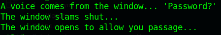
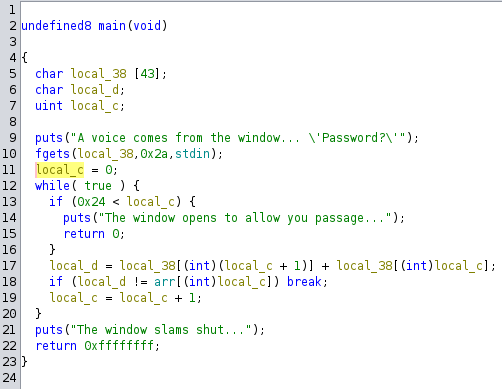

# Windows of Opportunity (rev)
### Starting out
As with any reversing problem, I start by running `strings` on it. Strings allows me to see any, well, strings that are in the program.  
  
In strings, we can see that this is a basic password challenge. Essentially, there is a password hidden inside the file so that the input can be checked. To find this password, we must now disassemble the program and look at what it's really doing.

### Disassembly with Gidra
Once the program is loaded into Ghidra, we can navigate to the main function and get a feel for how the program is meant to work.  
  
Because this program is fairly simple, the code given by Ghidra is pretty accurate. From that, we can see that the code takes the user input and itterates through each character. For each of the characters, it adds the integer value of the current character and the next character before checking to see if it exists in an array. We know that the fist characters are going to be H, T, B, and {, so we can check our assumptions by adding their integer values (72, 84, 66, and 123 respecively). Double clicking on the array name in Ghidra brings us to where the value is stored, and we can see that it matches up

Array (decimal): 156 150 189 175 147 195 148 96 162 209 194 207 156 163 166 104 148 193 215 172 150 147 147 214 168 159 210 148 167 214 143 160 163 161 163 86 158
72 + 84 = 156, 84 + 66 = 150, 66 + 123 = 189, 123 + ? = 175

### Solution
The next step is to figure out how to get the other characters. Based on the calculation above, we can see that we only need to solve for the next character by taking the current value in the array and subtracting the current known value. For the last equation above, we get 175 - 123 = 52. 52 on the ASCII table is '4'. To speed up the process, I wrote a quick [script](./windows_solve.py) that can automatically do this for us.